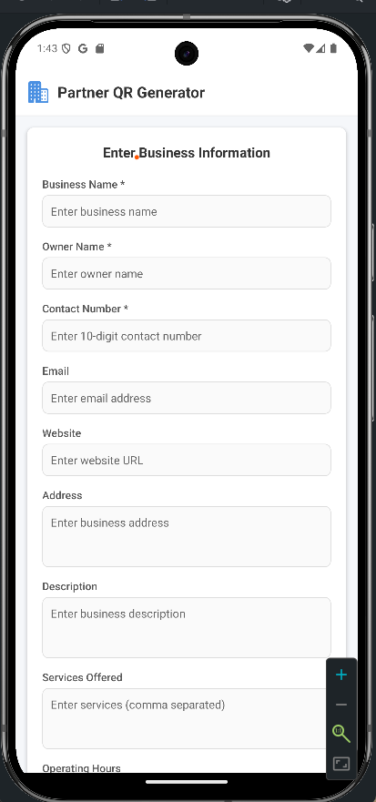

# 🚀 QR Express

## 📌 Overview
QR Express is a web-based platform designed to help businesses register and share their details through QR codes. The **Partner App** enables businesses to fill out a form with essential details, and upon submission, a **QR code is generated**. Users can then scan this QR code using the **User App** to view business details instantly.

## 🛠 Features
✅ **Business Registration** - Businesses can register by filling out a structured form.
✅ **Automatic QR Code Generation** - A QR code is created instantly based on the provided details.
✅ **QR Code Scanning** - Users can scan the QR code to retrieve business information.
✅ **Smooth UI & UX** - Designed for an intuitive and seamless user experience.

## 📸 Demo



---

## 🏗 Tech Stack
| Component    | Technology |
|-------------|------------|
| **Frontend**  | React Native (Expo) |
| **Backend**   | Express.js |
| **Database**  | MongoDB |
| **QR Code Generation** | qrcode.react |

---

## 🎯 How to Set Up and Run the Project
Follow these steps to clone and run the project on your local machine:

### 🔻 Clone the Repository
```sh
git clone https://github.com/yourusername/partner-app.git
cd partner-app
```

### 🔹 Install Dependencies
```sh
npm install
```

### ▶️ Start the Project
```sh
npm start
```
Press **'a'** to open the app in the Expo Go simulator.

---

## 📢 Contributing
We welcome contributions! Follow these steps to contribute:
1. Fork the repository.
2. Create a new branch (`git checkout -b feature-branch`).
3. Make your changes and commit them.
4. Push to your branch (`git push origin feature-branch`).
5. Open a pull request for review.

---

## 📩 Contact
For any queries or feedback, reach out to:
📧 **Email:** yourname@example.com  
🔗 **LinkedIn:** [Your Profile](https://www.linkedin.com/in/yourprofile)

---

**📢 Made with ❤️ for businesses to connect effortlessly!**

