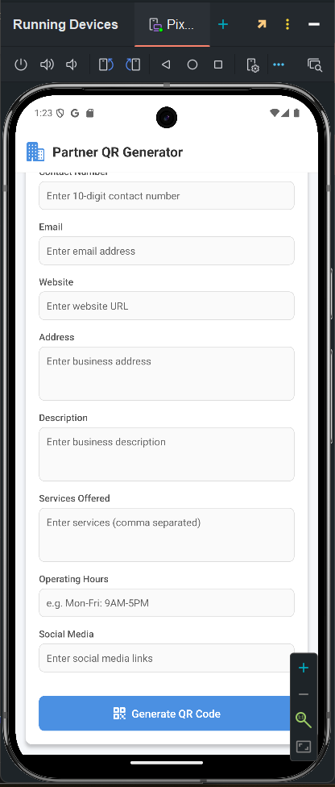

🚀 QR Express
📌 Overview
The Partner App is a web-based platform that allows businesses to register by filling out a form with details like:

Business Name
Address
Business Idea
Contact Details
operating hours 
social media handles 
After submitting the form, a QR Code is generated on the screen. This QR code can be scanned by users using the companion User App, which will display the business details on their screen.

🛠 Features
✅ Business registration through an interactive form
✅ Automatic QR Code generation based on input details
✅ Users can scan the QR Code to retrieve business details
✅ Smooth UI for a seamless experience

📸 Demo

🏗 Tech Stack
Frontend: React Native (Expo)
Backend: Express.js
Database: MongoDB
QR Code Generation: qrcode.react
🎯 How to Set Up and Run the Project
Follow these steps to clone and run the project on your local machine:

🔻 Clone the Repository
sh
Copy
Edit
git clone https://github.com/yourusername/partner-app.git
cd partner-app
🔹 Install Dependencies
sh
Copy
Edit
npm install
▶️ Start the Project
sh
Copy
Edit
npm start
Press "a" to open the app in the Expo Go simulator.

📢 Contributing
We welcome contributions! Feel free to fork the repo, create a new branch, and submit a pull request.

📩 Contact
For any queries or feedback, reach out to:
📧 Email: yourname@example.com
🔗 LinkedIn